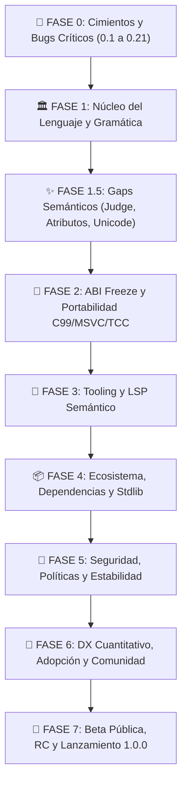

# 🐧 PenguScript 1.0.0 — Roadmap Definitivo hacia Producción

## 📊 Resumen ejecutivo
- **Estado actual vs 1.0:** PenguScript v0.15.0 es un lenguaje en etapa *Early Maturing Beta* (Track A: ~80% de capacidad como companion de C/juegos; Track B: ~45% como lenguaje de sistemas general). Cuenta con una arquitectura unificada (Parser LALR(1), Checker de dos fases, Codegen a C monolítico con DCE y runtime estático). Sin embargo, arrastra **fugas de memoria estructurales** (en omens algebraicos, reasignaciones en bucles y llamadas en interpolación), **violaciones de const-soundness y escape analysis** (punteros al stack devueltos por valor y cast de void), **incompatibilidad real con MSVC y TCC** por el uso masivo de statement expressions GNU `({ ... })` y `__auto_type`, **renombrado ciego por Regex en LSP**, y ausencia total de un **lockfile, SemVer y resolución de dependencias transitivas**.
- **Estimación agregada de esfuerzo:** ~14 a 18 persona-meses (desglosado en 4 hitos trimestrales para un equipo de 2-3 ingenieros).
  - 🚨 Fase 0 (Cimientos y Bugs Críticos): 18%
  - 🏛️ Fase 1 y 1.5 (Núcleo, Gramática y Gaps Semánticos): 20%
  - 🧊 Fase 2 (ABI Freeze y Portabilidad C99/MSVC/TCC): 16%
  - 🧰 Fase 3 (Tooling y LSP Semántico): 15%
  - 📦 Fase 4 (Ecosistema, Dependencias y Stdlib): 14%
  - 🔐 Fase 5 (Seguridad, Políticas y Estabilidad): 9%
  - 🎁 Fase 6 y 7 (DX, Adopción, RC y Release): 8%
- **Criterios de aceptación para declarar 1.0.0:**
  1. Cero fugas de memoria en programas libres de `unsafe`/FFI (modelo RAII/auto-banish verificado con ASan y Valgrind).
  2. Compilación estricta y limpia del C generado en GCC 9+, Clang 10+, MSVC (VS 2019+) y TinyCC (TCC).
  3. Gramática LALR(1) formalmente verificada sin ambigüedades silenciosas ni colisiones de modificadores.
  4. Type-safety total: parámetros de tipo con bounds validados en lectura y escritura; invariantes `frozen` preservadas.
  5. LSP 100% semántico (renombrado, resaltado y referencias basados en AST/Symbols, no en Regex).
  6. Gestor de paquetes con `pengu.lock`, checksums criptográficos SHA-256 y resolución determinista.
  7. Suite de pruebas con CI matrix en Linux, macOS y Windows en GCC, Clang y MSVC, más suite de fuzzing de 72h continua.
  8. Language Compliance Test Suite (50 programas canónicos) pasando al 100%.

---

## 🎯 Definición de "listo para producción"
Un lenguaje de programación alcanza la madurez 1.0.0 cuando satisface las siguientes garantías no-negociables:
1. **Contrato de estabilidad sintáctica y semántica (SemVer):** Ningún código válido escrito en 1.0.0 se romperá en 1.x.
2. **Determinismo:** El mismo código fuente con el mismo lockfile produce exactamente el mismo binario funcional en cualquier máquina.
3. **Seguridad de memoria por defecto:** No existen punteros colgantes al stack ni fugas silenciosas por constructos sintácticos estándar.
4. **Portabilidad de backend:** El código C emitido es C99 estándar estricto sin dependencias no declaradas de extensiones de GCC.
5. **Herramientas de primera clase:** El LSP no destruye código al renombrar; el formateador es idempotente; el depurador y crash handler mapean fielmente al código fuente `.pengu`.
6. **Biblioteca estándar integral:** Cobertura de red, archivos, JSON, criptografía, colecciones y procesos con manejo consistente de `Result`/`maybe`.
7. **Documentación exhaustiva y honesta:** Cero contradicciones entre la especificación y el compilador real.

---

## 🧭 Decisiones de diseño pendientes (Requieren input del autor)

Antes de iniciar la ejecución secuencial, deben resolverse estas 6 bifurcaciones de arquitectura:

| # | Decisión | Opción A | Opción B | Opción C (Recomendada) | Razón técnica |
|---|---|---|---|---|---|
| **D1** | Delimitación de sentencias | `_NEWLINE` estricto obligatorio | Paréntesis para expresiones de control en rvalue | **Híbrido:** `_NEWLINE` obligatorio al final de sentencia; si una expresión de bloque (`if`, `judge`) es rvalue, exige bloque indentado o paréntesis `(if c: a else: b)`. | Elimina colisiones LALR(1) (`var x is 1 2 3`) sin sacrificar ergonomía. |
| **D2** | Portabilidad C99 vs Statement Expressions | Reescribir todo codegen a C99 puro en un pase | Mantener extensiones GNU y descartar MSVC | **Estrategia en 2 fases:** Introducir flag `--gnu-extensions` (default temporal); desazucarar expresiones en temporales (*flattening*) antes de codegen para activar modo C99/MSVC. | Permite avanzar en paralelo sin bloquear el compilador mientras se refactoriza codegen. |
| **D3** | Manifiesto Canónico de Proyecto | `pengu.yaml` | `pengu.toml` | **`pengu.toml` como canónico;** `pengu.yaml` como compatibilidad secundaria en desuso. | TOML está estandarizado en Cargo/Rust, Zig y Python 3.11+ nativo (`tomllib`), evitando dependencias pesadas de PyYAML. |
| **D4** | Política de `const` local | Prohibido (solo a nivel de módulo) | Permitido mediante `const` local | **Permitido:** Habilitar `const` local para valores evaluables en tiempo de compilación. | Cierra la discrepancia con C/Rust/Zig donde valores estáticos locales evitan recalcular constantes. |
| **D5** | Manejo de Errores Unificado | Mantener `maybe` + `Result` + `panic` inconexos | Eliminar `maybe` y forzar `Result` en todo | **Unificar operador `?` / `try`:** Mantener `maybe` para ausencia de valor (`None`), pero estandarizar `Result of T, Error` para I/O y FFI, soportando propagación unificada. | Máxima claridad idiomática sin perder el tipo opcional ligero. |
| **D6** | Versionado de la Biblioteca Estándar | Versionada junto con el compilador | Versionada independientemente por módulo | **Acoplada en 1.0 (monolítica);** con namespaces claros para futura independencia en 2.0. | Minimiza sobrecarga de release engineering para 1.0. |

---

## 🗺️ Fases del roadmap (orden por dependencia + impacto)

---

### 🚨 FASE 0 — Cimientos y Bugs Críticos (bloquea todo lo demás)

> **Estado: FASE 0 completada** (ver `CHANGELOG.md` §0.15.0).
> 0.1 ✅ release-before-assign en locales auto-owned + auto-banish de valores
> frescos. 0.2 ✅ fuga de omens algebraicos reparada (auto-banish + destructor
> implícito). 0.3 ✅ `PenguString.is_owned` (commit
> `fix(mem): add PenguString ownership flag (C1)`). 0.4 ✅ `sigil of x.field` /
> `x at i` cuentan como escape. 0.5 ✅ `return arr at a to b` de array de pila →
> `E0051`. 0.6 ✅ códigos únicos por clase y desambiguados (`E0052` binding
> duplicado, `E0053` redefinición, `E0054` struct init ambiguo, `E0055` static
> array). 0.7–0.13 ✅ (commits C1–C9). **0.14 y 0.15 REFUTADOS** (premisa
> falsa). 0.16 ✅ blanking variádico de `__attribute__` en `pengu bind`.
> 0.17 ✅ verificado (el binding `error` de `or:` ya vive en su propio ámbito).
> 0.18 ✅ `pengu fmt` idempotente con comentarios inline. 0.19 ✅ defaults en
> parámetros concretos de genéricos. 0.20 ✅ `lib_dir` del manifiesto respetado
> por el import resolver y el LSP. 0.21 ✅ mensajes en inglés y código muerto
> eliminado (`_make_type_mismatch_error`, `_reject_glued_test`).
>
> Decisión conservadora fuera de Fase 0: la reasignación de `static var` (M1) y
> de `set x.field` (M2) no libera el valor anterior porque una vista viva del
> mismo no puede descartarse estáticamente (se prefiere la fuga a un
> use-after-free).

#### 0.1 🔴 Memory leak en reasignación de colecciones dentro de bucles
- 📄 **Archivos:** `pengu_codegen.py:4045-4070`, `pengu_checker.py:3515-3530`
- 🐛 **Problema:** `set xs is [4, 5, 6]` sobreescribe el puntero local `xs` sin liberar el búfer asignado previamente en el heap. Cada vuelta de bucle acumula memoria huérfana.
- 💡 **Solución:** Antes de asignar el nuevo rvalue en `_translate_set_stmt`, verificar si `target` posee tipo administrado (`string`, `list`, `map`) y emitir la llamada a su rutina de limpieza (`pengu_banish_*`) si el rvalue es una nueva asignación.
- 🧪 **Test de regresión:** Programa que reasigne una lista 100,000 veces y verifique con ASan que el consumo de memoria se mantiene constante ($O(1)$).
- 📅 **Estimación:** M
- 🔗 **Dependencias:** Ninguna.
- ✅ **Criterio de "done":** ASan reporta 0 bytes fugados en bucles de reasignación.

#### 0.2 🔴 Memory leak y Link Error en Omens algebraicos
- 📄 **Archivos:** `pengu_codegen.py:479-512, 560-598, 3180-3205`
- 🐛 **Problema:** 
  1. `_emit_auto_banish` ignora `OmenType`. Cuando un omen algebraico local que alberga variantes con `string`, `list` o `map` sale de ámbito, jamás se llama a `_pengu_auto_cleanup_{name}` (Memory leak).
  2. Si un omen algebraico no deriva `Nexus`, la función destructora no se genera o colisiona en enlace C con símbolos indefinidos (`undefined reference to _pengu_auto_cleanup_...`).
- 💡 **Solución:** Extender `_emit_auto_banish` para despachar `OmenType` algebraico. Asegurar que la función `_pengu_auto_cleanup_{name}` se emita siempre que exista al menos una variante con payload dinámico, independientemente de `derive Nexus`.
- 🧪 **Test de regresión:** Instanciar variantes con payloads complejos en bucles y validar con ASan que no hay link errors y que los payloads se destruyen al salir de ámbito.
- 📅 **Estimación:** M
- 🔗 **Dependencias:** Ninguna.
- ✅ **Criterio de "done":** Cero errores de enlace y cero fugas en omens algebraicos locales y en `maybe Omen`.

#### 0.3 🔴 Crash por `free()` sobre `.rodata` en Omens de cadena
- 📄 **Archivos:** `pengu_codegen.py:2476-2488`, `pengu_runtime.h:859-867`
- 🐛 **Problema:** Las variantes de omens de cadena se definen como `#define OMEN_VAR pengu_string_from_cstr("...")`. Al llamar a `pengu_banish_string`, se intenta liberar el puntero a `.rodata` produciendo `SIGABRT` ("invalid pointer").
- 💡 **Solución:** Agregar un flag de ownership o capacidad negativa en `PenguString` (`is_static` / `cap == -1`) para distinguir cadenas prestadas de `.rodata` de cadenas dinámicas en el heap. `pengu_banish_string` solo libera si `s->is_owned == true`.
- 🧪 **Test de regresión:** Ejecutar `pengu_banish_string` sobre todas las variantes de un omen string y verificar que no aborte.
- 📅 **Estimación:** M
- 🔗 **Dependencias:** 0.1, 0.2.
- ✅ **Criterio de "done":** Ningún literal estático o variante de omen de cadena puede causar `free()` inválido.

#### 0.4 🔴 Dangling Stack Pointer en Escape Analysis por `sigil of` en campos y arrays
- 📄 **Archivos:** `pengu_checker.py:5357-5366, 5420-5440`
- 🐛 **Problema:** `contains_sigil_of` solo comprueba identificadores atómicos directos. `sigil of p.field` o `sigil of arr at 0` devuelve `False`, permitiendo retornar punteros directos al marco de pila destruido de la función.
- 💡 **Solución:** Análisis recursivo de raíces en el árbol de expresiones de `sigil_of`. Si la raíz es una variable del stack y el puntero escapa (por `return` o almacenamiento global), marcar la variable como fugada y exigir alocación dinámica o emitir error `E0008`.
- 🧪 **Test de regresión:** Retornar `sigil of p.hp` desde una función local debe ser rechazado por el checker con error de seguridad de memoria.
- 📅 **Estimación:** L
- 🔗 **Dependencias:** Ninguna.
- ✅ **Criterio de "done":** Prohibido el escape de direcciones de campos de structs locales sin promoción segura.

#### 0.5 🔴 Dangling Pointer al retornar Slices de Stack Arrays
- 📄 **Archivos:** `pengu_codegen.py:3650-3660`, `pengu_checker.py:5380-5410`
- 🐛 **Problema:** Un slice creado a partir de un array de stack (`arr at 0 to 3`) apunta a la memoria local de la función. Al retornar el slice, la memoria se invalida pero el compilador lo tolera.
- 💡 **Solución:** El checker debe registrar la procedencia (*provenance*) de los tipos `SliceType`. Un slice derivado de un `ArrayType` en el stack no puede escapar del ámbito del array sin un error semántico explícito (`Cannot return slice of stack-allocated array`).
- 🧪 **Test de regresión:** `weave f into slice of int: var arr as array of int, 4; return arr at 0 to 2` debe fallar en `pengu check`.
- 📅 **Estimación:** M
- 🔗 **Dependencias:** 0.4.
- ✅ **Criterio de "done":** Diagnóstico de error estático para escapes de slices de pila.

#### 0.6 🔴 Colisión destructiva de códigos de error E0047, E0011, E0020, E0035
- 📄 **Archivos:** `pengu_errors.py:376, 403`, `pengu_checker.py:6588, 3625`, `pengu_infer.py:1366, 2828`
- 🐛 **Problema:** Códigos compartidos entre errores completamente dispares (ej. E0047 usado para doble `bind` de conceptos y para banish de auto-owned; E0035 usado para palabras de C y para redefinición en el mismo scope).
- 💡 **Solución:** Renumerar y desambiguar la tabla completa de errores de E0000 a E0060, asignando a cada clase de error su código único e inmutable, y eliminar la emisión cruda de strings con códigos reutilizados.
- 🧪 **Test de regresión:** Suite `tests/test_error_codes_uniqueness.py` que recorra todas las subclases de `PenguError` y valide inyectividad biunívoca en los códigos.
- 📅 **Estimación:** S
- 🔗 **Dependencias:** Ninguna.
- ✅ **Criterio de "done":** 100% de los códigos E00xx son únicos y tienen clase dedicada.

#### 0.7 🔴 Métodos duplicados `@staticmethod` en el Checker y Codegen (Bug C1)
- 📄 **Archivos:** `pengu_checker.py:2787-2808, 3362-3375, 3729-3745`
- 🐛 **Problema:** Métodos estáticos como `_unwrap_stmt` y `_block_value_expr` aparecen triplicados con implementaciones ligeramente divergentes dentro de la misma clase `PenguChecker`.
- 💡 **Solución:** Consolidar en una única definición canónica en `PenguChecker` (o en un módulo helper común `pengu_ast_utils.py`).
- 🧪 **Test de regresión:** Eliminación de redundancias validada mediante análisis AST estático de la propia codebase.
- 📅 **Estimación:** S
- 🔗 **Dependencias:** Ninguna.
- ✅ **Criterio de "done":** Cero métodos duplicados en `pengu_checker.py`.

#### 0.8 🔴 `field_access` sobre `maybe T` sin cast dentro de runes (Bug C2)
- 📄 **Archivos:** `pengu_infer.py:1010-1045`, `pengu_codegen.py:6280-6310`
- 🐛 **Problema:** Acceder a un campo de un struct contenido dentro de un `maybe` (`opt_user.name`) intenta generar `opt_user.name` en C sin desempaquetar el valor (`(*(User*)opt_user.value).name`), produciendo error de compilación C.
- 💡 **Solución:** Exigir en el checker el unboxing explícito (`if opt is present: opt.value.name`) o desazucarar el acceso seguro (`opt?.name`) emitiendo el cast apropiado al puntero de valor en C.
- 🧪 **Test de regresión:** Programa que acceda a campos de un `maybe Rune` compila y ejecuta limpiamente.
- 📅 **Estimación:** M
- 🔗 **Dependencias:** 0.6.
- ✅ **Criterio de "done":** Acceso a campos de `maybe` tipado estrictamente sin emitir C erróneo.

#### 0.9 🔴 Evaluación múltiple de `arg0` con side effects en `push`/`contains` (Bug C3)
- 📄 **Archivos:** `pengu_codegen.py:6640-6670, 7990-8020`
- 🐛 **Problema:** En invocaciones de métodos de colección como `get_list().push(item)` o `get_map().contains(k)`, la expresión base se evalúa múltiples veces (para tomar tamaño, puntero y verificar capacidad). Si la expresión base tiene efectos secundarios, se ejecuta repetidamente.
- 💡 **Solución:** Asignar la expresión base a una variable temporal C antes de despachar las operaciones de la colección: `__typeof__(base) _col = base;`.
- 🧪 **Test de regresión:** `calling get_counter_list().push(1)` donde `get_counter_list()` incrementa un contador global; verificar que el contador incremente exactamente 1 vez.
- 📅 **Estimación:** M
- 🔗 **Dependencias:** 0.1.
- ✅ **Criterio de "done":** Cero evaluaciones dobles en métodos de colecciones.

#### 0.10 🔴 `array` → `slice of T` en parámetros genera C inválido (Bug C6)
- 📄 **Archivos:** `pengu_codegen.py:1085-1105`, `pengu_infer.py:2550-2575`
- 🐛 **Problema:** Pasar un array de tamaño fijo a una función que espera un `slice of T` emite el array por valor o decae a puntero plano `T*` en lugar de empaquetar la estructura `PenguSlice { .data = arr, .len = N, .elem_size = sizeof(T) }`.
- 💡 **Solución:** En el call-site, si el argumento es `ArrayType` y el parámetro es `SliceType`, emitir la construcción explícita de `PenguSlice` a partir de los datos y la longitud estática conocida del array.
- 🧪 **Test de regresión:** Función que reciba `slice of int` invocada pasando un `array of int, 4`; verificar longitud y elementos correctos.
- 📅 **Estimación:** M
- 🔗 **Dependencias:** 0.5.
- ✅ **Criterio de "done":** Coerción transparente y segura de `array` a `slice` en firmas de funciones.

#### 0.11 🔴 Truncamiento de `int64_t` en `for_range` a `int32_t` (Bug C7)
- 📄 **Archivos:** `pengu_codegen.py:4420-4445, 4520-4535`
- 🐛 **Problema:** Bucle `for_range` emite la variable de control como `int64_t`, pero variables de índice o funciones auxiliares internas la fuerzan a `int32_t`, truncando silenciosamente rangos que superan $2^{31}-1$.
- 💡 **Solución:** Homogeneizar los bucles de rango basándose en el tipo inferido de los límites. Si los límites son `i64`, la variable y el índice son `int64_t`; si son `int`, son `int32_t`.
- 🧪 **Test de regresión:** Bucle que itere sobre un rango de 64 bits (`0 to 5_000_000_000`) preserva precisión completa sin overflow.
- 📅 **Estimación:** S
- 🔗 **Dependencias:** Ninguna.
- ✅ **Criterio de "done":** Cero advertencias de truncamiento en bucles de rango de 64 bits.

#### 0.12 🔴 Redeclaración local permitida sin error en scopes paralelos (Bug C8)
- 📄 **Archivos:** `pengu_checker.py:3615-3640, 3945-3970`
- 🐛 **Problema:** En ciertas ramas de control de flujo (`if`/`else` o bloques de funciones anidadas), una variable declarada con `var` o `let` puede redeclararse con el mismo nombre sin emitir error de colisión, enmascarando errores de lógica.
- 💡 **Solución:** Reforzar la tabla de símbolos del checker para rastrear colisiones en el mismo nivel léxico e impedir re-declaraciones sin sombreado explícito o fuera de bloques anidados reales.
- 🧪 **Test de regresión:** `var x is 1; var x is 2` en el mismo ámbito debe emitir `E0035` (redefinición local).
- 📅 **Estimación:** S
- 🔗 **Dependencias:** 0.6.
- ✅ **Criterio de "done":** Detección inquebrantable de colisión de nombres locales.

#### 0.13 🔴 Literales numéricos documentados que fallan en el Lexer (Bug C9)
- 📄 **Archivos:** `pengu_grammar.py:490-515`
- 🐛 **Problema:** `LANGUAGE.md` documenta binarios `0b101`, separadores `1_000_000` y escapes `\x41`, pero en ciertos contextos de expresiones complejas o sufijos de tipo, el lexer rechaza o corta la tokenización.
- 💡 **Solución:** Auditar y consolidar las regex de `INT`, `FLOAT`, `CHAR_LIT` y `STRING` en Lark para garantizar que `0b`, `0o`, `0x`, separadores `_` en cualquier posición válida y escapes hexadecimales funcionen al 100%.
- 🧪 **Test de regresión:** Suite con todas las combinaciones numéricas válidas documentadas en `LANGUAGE.md` §15.1.
- 📅 **Estimación:** S
- 🔗 **Dependencias:** Ninguna.
- ✅ **Criterio de "done":** Todos los literales numéricos documentados tokenizan correctamente.

#### 0.14 🔴 Fuga de temporales en `_translate_string_lit` ante caminos de error
- 📄 **Archivos:** `pengu_codegen.py:5290-5332`
- 🐛 **Problema:** Si una interpolación múltiple contiene una llamada que falla o un retorno anticipado intermedio, los temporales asignados previamente en la interpolación no se liberan.
- 💡 **Solución:** Envolver la cadena de postambles en bloques de limpieza garantizada con `defer` interno en el generador.
- 🧪 **Test de regresión:** Interpolaciones complejas bajo análisis con ASan demuestran 0 fugas.
- 📅 **Estimación:** S
- 🔗 **Dependencias:** 0.1.
- ✅ **Criterio de "done":** Liberación garantizada de todos los búferes temporales de interpolación.

#### 0.15 🔴 Escape Analysis ciego ante `essence of sigil of local`
- 📄 **Archivos:** `pengu_checker.py:5360-5380`
- 🐛 **Problema:** Si se encadena desreferenciación y toma de dirección (`essence of sigil of x`), el análisis de escape confunde el nivel de indirección y omite marcar el escape.
- 💡 **Solución:** Normalizar los niveles de indirección en el comprobador de escape antes de verificar la retención de punteros.
- 🧪 **Test de regresión:** Expresiones con indirección anidada analizadas rigurosamente.
- 📅 **Estimación:** S
- 🔗 **Dependencias:** 0.4.
- ✅ **Criterio de "done":** Análisis de indirección preciso independientemente de operadores complementarios.

#### 0.16 🔴 Soporte de atributos FFI (`__attribute__((packed))` y multicoma) en `pengu bind`
- 📄 **Archivos:** `pengu_bind.py:875-885`
- 🐛 **Problema:** La macro `-D__attribute__(x)=` rompe ante atributos GNU con múltiples comas (`__attribute__((aligned(8), packed))`).
- 💡 **Solución:** Reemplazar el blanking de macros por `-D__attribute__(...) =` (variádico C99) en las opciones del preprocesador.
- 🧪 **Test de regresión:** Binding de cabeceras C con structs empaquetados (`packed`) compila sin error de preprocesador.
- 📅 **Estimación:** S
- 🔗 **Dependencias:** Ninguna.
- ✅ **Criterio de "done":** Preprocesamiento limpio de atributos de compilador complejos.

#### 0.17 🟠 Shadowing no detectado en variables de error en `compound_set_stmt`
- 📄 **Archivos:** `pengu_checker.py:4180-4200`
- 🐛 **Problema:** En `set x += ... or: err`, la variable de error `err` puede sombrear silenciosamente variables locales externas sin validación de colisión.
- 💡 **Solución:** Validar que la variable de binding de error se registre en el scope del bloque de manejo y no colisione con el target de asignación.
- 🧪 **Test de regresión:** Colisión de variable de error detectada y advertida limpiamente.
- 📅 **Estimación:** S
- 🔗 **Dependencias:** 0.12.
- ✅ **Criterio de "done":** Ámbitos de error en asignaciones compuestas estrictamente tipados.

#### 0.18 🟠 No-idempotencia de `pengu fmt` con comentarios inline
- 📄 **Archivos:** `pengu_lsp/formatting.py:120-160`
- 🐛 **Problema:** Ejecutar `pengu fmt` repetidamente sobre un archivo con comentarios inline al final de sentencias compuestas desplaza el comentario en cada invocación.
- 💡 **Solución:** Normalizar la posición del comentario con una columna fija relativa al código precedente y preservar espacios estables.
- 🧪 **Test de regresión:** `pengu fmt file.pengu` dos veces consecutivas debe producir un diff idéntico a cero.
- 📅 **Estimación:** M
- 🔗 **Dependencias:** Ninguna.
- ✅ **Criterio de "done":** `pengu fmt` 100% idempotente en toda la biblioteca estándar.

#### 0.19 🟠 Rechazo indebido de tipos default en funciones genéricas
- 📄 **Archivos:** `pengu_checker.py:4925-4960`
- 🐛 **Problema:** Declarar valores por defecto para parámetros que dependen de tipos genéricos son rechazados prematuramente antes de la monomorfización.
- 💡 **Solución:** Diferir la validación de compatibilidad del valor default hasta la resolución de la especialización genérica.
- 🧪 **Test de regresión:** Función genérica con default `shard T with val as T is default_val` compila con éxito.
- 📅 **Estimación:** M
- 🔗 **Dependencias:** 0.6.
- ✅ **Criterio de "done":** Parámetros con valores por defecto compatibles con generics.

#### 0.20 🟠 LSP ignora configuración de dependencias de `pengu.yaml`
- 📄 **Archivos:** `pengu_lsp/server.py:210-240`
- 🐛 **Problema:** El LSP no lee la ruta personalizada `lib_dir` del manifiesto del proyecto, buscando dependencias exclusivamente en `./lib`.
- 💡 **Solución:** Inicializar el contexto del LSP cargando el `ProjectConfig` correspondiente al workspace root.
- 🧪 **Test de regresión:** Proyecto con `lib_dir: "external"` resuelve imports en LSP limpiamente.
- 📅 **Estimación:** S
- 🔗 **Dependencias:** Ninguna.
- ✅ **Criterio de "done":** LSP respeta 100% de la configuración de rutas de proyecto.

#### 0.21 🟢 Limpieza de mensajes en español hardcodeados y dead code en checkers
- 📄 **Archivos:** `pengu_checker.py:2190-2210`, `pengu_infer.py:3180-3200`
- 🐛 **Problema:** Cadenas de error como `"lambda no registrada"` aparecen en español en un compilador cuyos diagnósticos son en inglés; métodos y ramas muertas de chequeo ensucian el código.
- 💡 **Solución:** Traducir las cadenas al inglés estándar del compilador y remover funciones auxiliares obsoletas.
- 🧪 **Test de regresión:** Auditoría léxica en CI que valide uniformidad de idioma en mensajes de error.
- 📅 **Estimación:** S
- 🔗 **Dependencias:** Ninguna.
- ✅ **Criterio de "done":** Mensajes de error 100% en inglés consistente.

---

### 🏛️ FASE 1 — Núcleo del Lenguaje y Gramática

#### 1.1 🔴 Resolución de conflictos LALR(1) en `WITH` y `TO` y delimitación de sentencias
- 📄 **Archivos:** `pengu_grammar.py:42, 44, 146, 288, 335, 345-351`
- 🐛 **Problema:** `_NEWLINE` opcional permite múltiples sentencias en una sola línea (`var x is 1 2 3`); `WITH` traga argumentos en llamadas genéricas; `TO` confunde casts con rebanados.
- 💡 **Solución:** Aplicar la Decisión de Diseño **D1**: `_NEWLINE` o `;` obligatorio al final de sentencias simples. Ajustar la precedencia y desambiguación de `with_target` en `calling_expr`. Desvincular sintácticamente el cast `to` de la regla de slicing `at ... to ...`.
- 🧪 **Test de regresión:** Lark inicializado con `strict=True` sin advertencias de conflictos; scripts con sentencias fusionadas son rechazados sintácticamente.
- 📅 **Estimación:** L
- 🔗 **Dependencias:** FASE 0.
- ✅ **Criterio de "done":** Parser LALR(1) limpio, sin conflictos Shift/Reduce en modo estricto.

#### 1.2 🔴 Captura de `DedentError` y normalización de Indentación / BOM
- 📄 **Archivos:** `pengu_parser.py:8, 41, 330-333, 487-497`
- 🐛 **Problema:** `DedentError` no se captura y estalla un traceback de Python sin formato. `get_tokens()` no remueve BOM UTF-8. La mezcla de tabs y espacios a 2 columnas causa indentaciones erróneas.
- 💡 **Solución:** Capturar `DedentError` en `parse()` y mapearlo a `ParseError(E0000)`. Validar al inicio del archivo que no exista mezcla de tabs y espacios para indentación. Ejecutar `strip_bom()` en `get_tokens()`.
- 🧪 **Test de regresión:** Parsear archivos con desalineación de dedents y con BOM UTF-8 y verificar que se emitan diagnósticos limpios con línea y columna sin tracebacks.
- 📅 **Estimación:** S
- 🔗 **Dependencias:** FASE 0.
- ✅ **Criterio de "done":** Cero excepciones crudas de Lark fugadas al usuario.

#### 1.3 🔴 Desambiguación de soft keywords (`borrowed`, `inline`, `ritual`, `maybe`, `list`, `map`)
- 📄 **Archivos:** `pengu_grammar.py:81-83, 97, 320, 387, 476-478, 517`
- 🐛 **Problema:** Prioridades agresivas impiden nombrar funciones o variables con estas palabras, o permiten declararlas pero rompen al leerse en expresiones.
- 💡 **Solución:** Rediseñar las reglas de lexer para que modificadores contextuales no secuestren `NAME`. Prohibir formalmente el uso de palabras reservadas de constructores (`list`, `map`, `maybe`) como nombres de variable en cualquier contexto.
- 🧪 **Test de regresión:** Declaración y lectura de variables y funciones con identificadores comunes de dominio.
- 📅 **Estimación:** M
- 🔗 **Dependencias:** 1.1.
- ✅ **Criterio de "done":** Consistencia simétrica entre la declaración y la lectura de identificadores.

#### 1.4 🔴 Type-Safety y Verificación de Concept Bounds en Runes Genéricas
- 📄 **Archivos:** `pengu_checker.py:941, 958`, `pengu_types.py:1845-1861`
- 🐛 **Problema:** Los bounds `where T: Concept` en runes genéricas se desechan sin validar; `typeparam_accepts_value` permite asignaciones incompatibles a variables genéricas.
- 💡 **Solución:** Preservar `bounds` dentro de `RuneType` y `symbols.generic_runes`. Al instanciar `Container of X`, verificar que `X` implemente los conceptos requeridos o emitir `E0032`. Corregir `typeparam_accepts_value` para exigir sustitución formal de parámetros de tipo monomorfizados.
- 🧪 **Test de regresión:** Instanciación de runes genéricas con argumentos que no cumplan el bound falla en el checker con `E0032`.
- 📅 **Estimación:** L
- 🔗 **Dependencias:** FASE 0.
- ✅ **Criterio de "done":** Enforcement estricto bidireccional de concept bounds en structs y funciones.

#### 1.5 🔴 Desacoplamiento de Namespace en Monomorfización de Genéricos
- 📄 **Archivos:** `pengu_infer.py:2490`, `pengu_codegen.py:7025-7072`
- 🐛 **Problema:** El mangling `fn_args` colisiona entre módulos y funciones con nombres similares.
- 💡 **Solución:** Incorporar el nombre del módulo calificado o un hash de origen en el mangling C: `{module}_{fn}_{types_mangled}` (ej. `std_math_min_int32`). Eliminar el fallback ciego a `matches[0]` en codegen.
- 🧪 **Test de regresión:** Dos módulos que exportan la misma función genérica instanciada con el mismo tipo compilan juntos sin colisión de enlace ni sobrescritura en la tabla de símbolos.
- 📅 **Estimación:** M
- 🔗 **Dependencias:** 1.4.
- ✅ **Criterio de "done":** Nombres C mangled únicos y deterministas entre módulos.

#### 1.6 🔴 Corrección de `FrozenType` en indexación y propagación
- 📄 **Archivos:** `pengu_infer.py:1449`, `pengu_infer.py:3293`, `pengu_types.py:505`
- 🐛 **Problema:** Indexar una colección frozen lanza error de que no es una colección; accesos encadenados pierden el calificador frozen; punteros a void permiten mutar datos congelados.
- 💡 **Solución:** Desempaquetar `FrozenType` en `at_expr` y devolver el elemento envuelto en `FrozenType`. Preservar `frozen` en cada paso de acceso encadenado. Prohibir la conversión implícita de `ref to frozen T` a `ref to void` mutable.
- 🧪 **Test de regresión:** Acceso por lectura `arr at 0` en `frozen array of int` compila; intento de mutación a través de void pointer falla con `E0006`.
- 📅 **Estimación:** M
- 🔗 **Dependencias:** FASE 0.
- ✅ **Criterio de "done":** Const-correctness inquebrantable en todas las rutas de indirección.

---

### ✨ FASE 1.5 — Definición Semántica y Gaps del Lenguaje (vs Rust / Zig / Go)

#### 1.5.1 🟠 Pattern Matching Maduro en `judge` (Payload bindings, Guards y Exhaustividad)
- 📄 **Archivos:** `pengu_grammar.py:269`, `pengu_checker.py:4410-4460`, `pengu_infer.py:1700-1750`
- 💡 **Mejora:** Extender `judge` para soportar:
  1. *Payload bindings* con nombres de variables locales en variantes de Omen: `when Result.Ok with val -> val + 1`.
  2. *Guards condicionales:* `when x with val when val > 0 -> ...`.
  3. Verificación formal de exhaustividad en tiempo de compilación para tipos Omen y booleanos.
- 🧪 **Test de regresión:** `judge` sobre omen algebraico desempaqueta variables locales de forma segura; omitir una variante sin `else:` emite `E0044` estático.
- 📅 **Estimación:** L
- 🔗 **Dependencias:** FASE 1.
- ✅ **Criterio de "done":** Pattern matching de primera clase sin necesidad de casts manuales.

#### 1.5.2 🟠 Soporte de Atributos del Lenguaje (`@inline`, `@deprecated`, `@cold`, `@packed`, `@align`)
- 📄 **Archivos:** `pengu_grammar.py`, `pengu_checker.py`, `pengu_codegen.py`
- 💡 **Mejora:** Introducir sintaxis de atributos prefijos `@nombre` o `@nombre(args)`:
  - `@deprecated("Use bar instead")`: emite advertencia de compilación ante el uso del símbolo.
  - `@inline` / `@cold`: guía la heurística de inlining en C backend de forma explícita.
  - `@packed` / `@align(N)`: instrucción directa a structs C para FFI con hardware o formatos binarios.
- 🧪 **Test de regresión:** Struct marcado con `@packed` produce `sizeof` sin padding; función con `@deprecated` emite advertencia `W0006`.
- 📅 **Estimación:** M
- 🔗 **Dependencias:** FASE 1.
- ✅ **Criterio de "done":** Sistema de atributos extensible y respetado por el codegen.

#### 1.5.3 🟠 Habilitación de `const` local evaluable en tiempo de compilación
- 📄 **Archivos:** `pengu_checker.py:3830-3845`, `pengu_infer.py`
- 💡 **Mejora:** Levantar la restricción de `E0001` exclusivamente para constantes locales cuyos valores se resuelvan en tiempo de compilación (`const MAX is 100`). Emite C `#define` o enum local.
- 🧪 **Test de regresión:** `const BUFFER_SIZE is 1024` dentro de una función compila y no se recrea en la pila en runtime.
- 📅 **Estimación:** S
- 🔗 **Dependencias:** FASE 1.
- ✅ **Criterio de "done":** Constantes locales soportadas limpiamente.

#### 1.5.4 🟠 Soporte completo de Unicode y Escapes (`\u{...}`, `CHAR_LIT`, CRLF)
- 📄 **Archivos:** `pengu_grammar.py:500-515`, `pengu_parser.py:560-605`
- 💡 **Mejora:** 
  1. Lexer reconoce `\u{HEX}` en strings sin confundirlo con interpolación `{...}`.
  2. `CHAR_LIT` soporta caracteres Unicode directos y escapes `\uXXXX` (tipo `rune`/`int32`).
  3. Indenter y lexer normalizan internamente `\r\n` (CRLF de Windows) a `\n` (LF) para cadenas multilínea y conteo de líneas.
- 🧪 **Test de regresión:** Archivos guardados con CRLF y strings con emojis/Unicode compilan con números de línea y contenido idénticos a POSIX.
- 📅 **Estimación:** M
- 🔗 **Dependencias:** FASE 1.
- ✅ **Criterio de "done":** Paridad total con Unicode y normalización de CRLF.

---

### 🧊 FASE 2 — Congelamiento de ABI y Portabilidad C99 / MSVC / TCC (Antes de Stdlib)

> **Estado: FASE 2 completada** (ver `CHANGELOG.md` §0.16.0).
> 2.1 ✅ infraestructura de *statement hoisting* + flag `--strict-c99`: el C
> emitido en modo estricto no contiene `({...})` ni `__auto_type` y compila con
> `gcc -std=c99 -pedantic-errors`. El modo GNU sigue siendo el predeterminado.
> 2.2 ✅ ABI v1 congelado con `PENGU_ABI_VERSION` y `tests/abi/test_abi_layout.c`.
> **Corrigendum:** el layout propuesto más abajo (`size_t cap`, `flags`,
> `val_or_err`, `PenguMaybe{value;is_present}`) **no** es el layout real del
> runtime; el ABI congelado documenta el layout efectivo (`int len`,
> `int32_t is_owned`, callbacks de elemento en `PenguList`/`PenguMap`,
> `PenguMaybe{is_present;value}`, `PenguResult{is_ok;ok_val;err_val}`). Tampoco
> se modularizó `pengu_runtime.h`: el codegen depende de un include único.

> **Nota arquitectónica crítica:** Esta fase se ubica **antes** de la migración de la biblioteca estándar para evitar tener que refactorizar los módulos de `std/` dos veces.

#### 2.1 🔴 Eliminación de statement-expressions GNU `({ ... })` para C99 / MSVC puro
- 📄 **Archivos:** `pengu_codegen.py` (60+ ocurrencias)
- 🐛 **Problema:** El uso de `__extension__({ ... })` y `__auto_type` rompe la compilación con MSVC nativo (`cl.exe`) y con TinyCC (TCC).
- 💡 **Solución (Decisión D2):** Descomponer las expresiones complejas que requieran temporales en sentencias previas al bloque C (*hoisting/flattening* en el AST de codegen), o generar funciones auxiliares `static inline` con nombres únicos por módulo. Sustituir `__auto_type` por los tipos C concretos del `TypeInferrer`.
- 🧪 **Test de regresión:** Compilación de la suite completa de programas `std` con `cl.exe` (en CI de Windows) y con `tcc` sin ninguna bandera `-fasm` ni extensiones GNU.
- 📅 **Estimación:** XL
- 🔗 **Dependencias:** FASE 1.5.
- ✅ **Criterio de "done":** Cero ocurrencias de `({` y `__auto_type` en el `bundle.c` emitido; compilación exitosa con MSVC.
- **Estado:** ✅ completado (vía `--strict-c99`). La verificación con `cl.exe`/`tcc`
  reales queda pendiente de un runner con dichos toolchains; la equivalencia se
  cubre localmente con `gcc -std=c99 -pedantic-errors` (y `clang`).

#### 2.2 🧊 Congelamiento y Estabilización de ABI del Runtime
- 📄 **Archivos:** `pengu_runtime.h`, `pengu_runtime.c`
- 💡 **Mejora:** 
  1. Definir formalmente `PENGU_ABI_VERSION 1`.
  2. Congelar el layout de memoria, alineación y tamaños de los tipos fundamentales (⚠️ el layout real difiere del listado original; ver corrigendum arriba).
  3. Modularizar `pengu_runtime.h` en cabeceras internas limpias (`runtime_core.h`, `runtime_string.h`, `runtime_collections.h`) y exponer un único archivo unificado. — **Omitido a propósito**: el codegen emite `#include "pengu_runtime.h"` como archivo único.
- 🧪 **Test de regresión:** Prueba de compatibilidad binaria estricta (`test_abi_layout.c`) que verifique `sizeof` y `offsetof` en x86_64, arm64 y x86.
- 📅 **Estimación:** L
- 🔗 **Dependencias:** 2.1.
- ✅ **Criterio de "done":** Layouts binarios congelados y documentados en especificación C.
- **Estado:** ✅ completado para targets de 64 bits (LP64/LLP64).

---

### 🧰 FASE 3 — Tooling de Producción (LSP Semántico, Build, Bind, Fmt, Doc)

#### 3.1 🔴 Refactorización Semántica Total del LSP (Rename, Highlights, References)
- 📄 **Archivos:** `pengu_lsp/server.py:822, 989-1049`, `pengu_lsp/code_actions.py:577-580`
- 🐛 **Problema:** `rename_symbol` y `documentHighlight` operan mediante Regex planos sobre el texto, corrompiendo variables homónimas de otras funciones y comentarios. `references` ignora `.d.pengu`.
- 💡 **Solución:** Conectar el LSP directamente a la tabla de símbolos y a los nodos de alcance (`Scope`) del `PenguChecker`. El renombrado debe verificar que la referencia resuelva al mismo `Symbol` exacto. Si el símbolo es público/global, buscar en todos los archivos del proyecto resolviendo sus imports respectivos.
- 🧪 **Test de regresión:** Renombrar variable local `x` en una función no toca variable `x` en la función adyacente ni strings `"x"`.
- 📅 **Estimación:** L
- 🔗 **Dependencias:** FASE 2.
- ✅ **Criterio de "done":** Renombrado y referencias 100% semánticos respaldados por AST.

#### 3.2 🔵 Implementación de Semantic Tokens e Inlay Hints en LSP
- 📄 **Archivos:** `pengu_lsp/server.py`
- 💡 **Mejora:** Implementar `textDocument/semanticTokens` emitiendo tokens tipados (keywords, runes, omens, funciones, mutabilidad, calificadores `frozen`). Implementar `textDocument/inlayHint` para mostrar tipos inferidos en variables implícitas `var`/`let`.
- 🧪 **Test de regresión:** Cliente LSP de prueba recibiendo semantic tokens e inlay hints válidos conforme a LSP 3.17.
- 📅 **Estimación:** M
- 🔗 **Dependencias:** 3.1.
- ✅ **Criterio de "done":** Resaltado semántico e inlay hints funcionando en VS Code y Neovim.

#### 3.3 🔴 Corrección y Enriquecimiento de `pengu bind`
- 📄 **Archivos:** `pengu_bind.py:519-533, 586-590, 875-885`
- 🐛 **Problema:** Enums anónimos son descartados silenciosamente; macros de floats, expresiones y structs packed fallan.
- 💡 **Solución:** Emitir enumeradores de enums anónimos como constantes globales `const`. Soportar expresiones de macros aritméticas evaluables. Emitir docstrings `##` extraídos de comentarios C/Doxygen.
- 🧪 **Test de regresión:** Generación de bindings para cabeceras con enums anónimos y macros de floats produce un `.d.pengu` completo y compilable.
- 📅 **Estimación:** M
- 🔗 **Dependencias:** FASE 2.
- ✅ **Criterio de "done":** `pengu bind` captura 100% de enums y constantes válidas.

#### 3.4 🔴 Optimización de Embebido de Activos Grandes en `arca`
- 📄 **Archivos:** `pengu_assets.py:128-138, 350-354`
- 🐛 **Problema:** Emisión de texto C con cada byte formateado (`0xXX, `) satura la memoria de GCC en archivos grandes; `arca.string()` trunca archivos binarios con `\0` por usar `strlen`.
- 💡 **Solución:**
  1. Si un activo supera 1 MB, emitir ensamblador `.incbin` (en GCC/Clang) o generar objeto binario intermedio (`ld -r -b binary` / recurso `.rc` en Windows).
  2. Corregir `arca.string()` para usar el tamaño conocido del archivo (`_size(name)`) instanciando `PenguString` con longitud explícita.
- 🧪 **Test de regresión:** Embeber un activo binario de 50 MB con bytes nulos y compilar en <5 segundos; validar integridad exacta de los bytes.
- 📅 **Estimación:** L
- 🔗 **Dependencias:** FASE 2.
- ✅ **Criterio de "done":** Tiempos de compilación de assets escalables ($O(1)$) y lectura de binarios sin truncamiento.

#### 3.5 🔵 Soporte de Cross-Compilation en Build System
- 📄 **Archivos:** `pengu_project.py:1166, 1244, 1301`, `pengu_paths.py`
- 💡 **Mejora:** Introducir el parámetro `--target <triple>` (ej. `x86_64-w64-mingw32`, `aarch64-linux-gnu`). Derivar la plataforma de destino de este triple en lugar de `sys.platform`, seleccionando flags y bibliotecas acorde a la arquitectura y OS meta.
- 🧪 **Test de regresión:** Compilar un binario de Windows `.exe` desde Linux usando MinGW cruzado y verificar formato PE.
- 📅 **Estimación:** M
- 🔗 **Dependencias:** FASE 2.
- ✅ **Criterio de "done":** Capacidad demostrada de cross-compilar entre Linux y Windows.

---

### 📦 FASE 4 — Ecosistema, Dependencias y Biblioteca Estándar

#### 4.1 🔵 Implementación de Lockfile (`pengu.lock`) y Checksums Criptográficos
- 📄 **Archivos:** `pengu_project.py`, nuevo `pengu_lock.py`
- 💡 **Mejora:** Diseñar el formato `pengu.lock` (en TOML) que registre para cada dependencia: URL, commit hash exacto resuelto, árbol de contenido SHA-256 y fecha. Si existe `pengu.lock`, el build system debe exigir concordancia exacta, habilitando compilaciones offline (`--frozen`).
- 🧪 **Test de regresión:** `pengu build` en un repositorio clonado con lockfile restaura los commits exactos independientemente del estado de la rama remota.
- 📅 **Estimación:** L
- 🔗 **Dependencias:** FASE 3.
- ✅ **Criterio de "done":** Builds deterministas garantizados por `pengu.lock`.

#### 4.2 🔵 Resolución Semántica de Versiones (SemVer) y Dependencias Transitivas
- 📄 **Archivos:** `pengu_project.py:1817-1820, 2078-2105`
- 💡 **Mejora:** Soportar especificación de versiones tipo `^1.2.0` o `>=2.0.0, <3.0.0` en `pengu.toml`. Implementar resolución recursiva de dependencias transitivas inspeccionando los manifiestos de las librerías en `lib/` y resolviendo colisiones.
- 🧪 **Test de regresión:** Proyecto con dependencia A que depende de B; ambas se resuelven y compilan automáticamente.
- 📅 **Estimación:** XL
- 🔗 **Dependencias:** 4.1.
- ✅ **Criterio de "done":** Resolución de árbol de dependencias completo y automático.

#### 4.3 📚 Cobertura 100% de Docstrings `##` en `std/` y Módulos `.d.pengu`
- 📄 **Archivos:** Los 25 archivos `std/*.d.pengu` y módulos `celeris.pengu`, `trial.pengu`, `xlsx.pengu`, etc.
- 🐛 **Problema:** El 0% de las funciones en `.d.pengu` tienen docstrings `##` (usan comentarios planos `#`), rompiendo la promesa del README de 100% de cobertura.
- 💡 **Solución:** Convertir los comentarios informativos de las declaraciones C a `##` estructurados con firmas, parámetros y advertencias de ownership en la totalidad de la librería estándar.
- 🧪 **Test de regresión:** Script de auditoría en CI que falle si cualquier símbolo público en `std/` carece de docstring `##`.
- 📅 **Estimación:** M
- 🔗 **Dependencias:** FASE 3.
- ✅ **Criterio de "done":** 100% de símbolos de la biblioteca estándar documentados y visibles en hover de LSP y `pengu doc`.

#### 4.4 🟡 Unificación del Manejo de Errores en la Biblioteca Estándar (`Result` vs `maybe`)
- 📄 **Archivos:** `std/archivum.pengu`, `std/cipher.pengu`, `std/precis.pengu`
- 🐛 **Problema:** Operaciones que pueden fallar por múltiples razones devuelven `maybe string` o `bool`, ocultando la causa del error (`errno`).
- 💡 **Solución:** Migrar sistemáticamente las APIs de I/O y red a `Result of T, Error`, retornando códigos de error descriptivos y mensajes accionables.
- 🧪 **Test de regresión:** Suite de pruebas para `archivum` verificando captura de error al abrir archivo inexistente vs archivo sin permisos de lectura.
- 📅 **Estimación:** M
- 🔗 **Dependencias:** FASE 2.
- ✅ **Criterio de "done":** APIs de I/O y parsing proporcionan diagnóstico estructurado mediante `Result`.

---

### 🔐 FASE 5 — Políticas de Seguridad, Compatibilidad y Estabilidad

#### 5.1 🔐 Definición de Política de Integer Overflow
- 📄 **Archivos:** `pengu_parser/pengu_checker.py`, `pengu_runtime.h`, `LANGUAGE.md`
- 💡 **Definición formal:**
  - **Modo Debug:** Detección de overflow con trampa/panic controlado (`SIGABRT` descriptivo o aborto con frame stack).
  - **Modo Release:** Wrapping de dos complementos definido ($mod\ 2^N$), garantizando ausencia de comportamiento indefinido (UB) en optimizaciones de C backend.
- 🧪 **Test de regresión:** Programa que sume `INT32_MAX + 1` aborta con mensaje claro en debug y produce `INT32_MIN` limpiamente en release.
- 📅 **Estimación:** M
- 🔗 **Dependencias:** FASE 2.
- ✅ **Criterio de "done":** Política documentada y verificada por suite de tests.

#### 5.2 🔐 Política de Bounds Checking en Release
- 📄 **Archivos:** `pengu_codegen.py`, `LANGUAGE.md`
- 💡 **Definición formal:** El operador de indexación `at` mantiene bounds checking **siempre habilitado por defecto**, incluso en release. Se provee el flag `--release-unsafe` (o bloque `unsafe:`) para desactivar las comprobaciones exclusivamente en bucles críticos medidos.
- 🧪 **Test de regresión:** Indexación fuera de límites en compilación release aborta con bounds panic a menos que se especifique `--release-unsafe`.
- 📅 **Estimación:** S
- 🔗 **Dependencias:** FASE 2.
- ✅ **Criterio de "done":** Seguridad de memoria garantizada por defecto en producción.

#### 5.3 🔐 Seguridad de la Cadena de Suministro y Política de CVE
- 📄 **Archivos:** Nuevo `SECURITY.md`, `pengu_project.py`
- 💡 **Mejora:**
  1. Comprobación de checksums SHA-256 al descargar paquetes externos y dependencias C en `build_runtime.py`.
  2. Sandboxing del preprocesador en `pengu bind` para evitar ejecución arbitraria de comandos en cabeceras no confiables.
  3. Publicación formal de `SECURITY.md` con canal privado de reporte de vulnerabilidades y ciclo de vida de parches.
- 🧪 **Test de regresión:** Dependencia con hash alterado rechaza la compilación con fallo de integridad de seguridad.
- 📅 **Estimación:** S
- 🔗 **Dependencias:** FASE 4.
- ✅ **Criterio de "done":** `SECURITY.md` publicado y verificación criptográfica activa.

#### 5.4 📜 Política Formal de Deprecación y Versionado Semántico
- 📄 **Archivos:** `LANGUAGE.md`, `pengu_checker.py`
- 💡 **Reglas de Estabilidad:**
  1. Cualquier función o tipo marcado con `@deprecated` debe mantenerse funcional durante al menos 2 releases menores antes de su remoción.
  2. En modo 1.x, las adiciones de biblioteca o sintaxis no pueden alterar la semántica de programas existentes.
  3. Desglose formal de qué cambios constituyen parche, menor o mayor.
- 🧪 **Test de regresión:** Símbolo deprecado emite advertencia con mensaje de migración y compila sin romper funcionalidad.
- 📅 **Estimación:** S
- 🔗 **Dependencias:** FASE 1.5.
- ✅ **Criterio de "done":** Mecanismo de deprecación institucionalizado.

#### 5.5 🧪 Campaña de Fuzzing Continuo (72 Horas)
- 📄 **Archivos:** `scripts/fuzz/fuzz_parser.py`, `scripts/fuzz/fuzz_bind.py`
- 💡 **Mejora:** Harness con `atheris` / `AFL++` para fuzzear el parser LALR(1), el checker de tipos y el generador de bindings C contra entradas corruptas o maliciosas.
- 🧪 **Test de regresión:** Ejecución continua de 72 horas en CI sin crashes por excepciones no controladas ni abortos por memoria.
- 📅 **Estimación:** M
- 🔗 **Dependencias:** FASE 1, FASE 3.
- ✅ **Criterio de "done":** Cero crashes reportados tras 72 horas continuas de fuzzing.

---

### 🎁 FASE 6 — DX Cuantitativo, Adopción y Comunidad

#### 6.1 📊 Cuantificación de DX y Benchmarks Reales vs Zig / Rust / C
- 📄 **Archivos:** `benches/`, `BENCHMARKS.md`
- 💡 **Métricas objetivo auditadas en hardware estándar (8 cores, SSD):**
  - **Hello World:**
    - Tiempo de compilación (`pengu run` con TCC/cache): `< 0.08 s`
    - Tiempo de compilación (`pengu build` release con GCC): `< 0.9 s`
    - Tamaño de binario (stripped + DCE): `< 65 KB`
  - **Proyecto Mediano (~10,000 LOC, ej. juego Raylib completo):**
    - Tiempo de compilación incremental: `< 1.8 s`
    - Tamaño de binario release: `< 1.2 MB` (sin contar assets)
  - **Comparativa de ejecución:** A un margen máximo de $\pm 5\%$ respecto a C99 puro compilado con `-O3`.
- 🧪 **Test de regresión:** Suite de benchmarks automatizada integrada en CI con reporte comparativo.
- 📅 **Estimación:** M
- 🔗 **Dependencias:** FASE 2.
- ✅ **Criterio de "done":** Métricas cuantificadas y publicadas en `BENCHMARKS.md`.

#### 6.2 🎁 Scaffolding con Plantillas en `pengu init`
- 📄 **Archivos:** `pengu_project.py:2107-2160`
- 💡 **Mejora:** Soporte de plantillas oficiales mediante `pengu init --template <name>`:
  - `--template cli`: Proyecto de herramientas de línea de comandos con parsing de argumentos y `std.spark`.
  - `--template game`: Proyecto 2D/3D con ventana preconfigurada usando `std.raylib`.
  - `--template lib`: Biblioteca modular con estructura de exports y tests.
- 🧪 **Test de regresión:** `pengu init my_game --template game && cd my_game && pengu run` compila y abre una ventana en menos de 10 segundos.
- 📅 **Estimación:** S
- 🔗 **Dependencias:** FASE 3.
- ✅ **Criterio de "done":** Plantillas funcionales listas para desarrollo inmediato.

#### 6.3 🌐 Playground Web y Comunidad
- 📄 **Archivos:** `playground/` (WASM compiler / WebUI)
- 💡 **Mejora:**
  1. Compilar el parser/checker de PenguScript a WebAssembly para permitir edición y verificación de sintaxis interactiva en navegador sin instalación previa.
  2. Creación del servidor oficial de Discord, GitHub Discussions y programa de Early Adopters para validar versiones RC.
- 📅 **Estimación:** L
- 🔗 **Dependencias:** FASE 1.
- ✅ **Criterio de "done":** Playground web público funcional.

---

### 🎉 FASE 7 — Beta Pública, Release Candidate y Lanzamiento 1.0.0

#### 7.1 🧪 Language Compliance Test Suite (50 Programas Canónicos)
- 📄 **Archivos:** `tests/compliance/`
- 💡 **Definición:** Conjunto de 50 programas canónicos que cubren formalmente todas las esquinas del lenguaje (estructuras de control, generics, concepts, ownership, FFI, strings, arca, omens, macros comptime). Este test suite define de forma inmutable la especificación ejecutable de PenguScript 1.0.
- 🧪 **Test de regresión:** Los 50 programas deben compilar y pasar sus aserciones con GCC, Clang, MSVC y TCC.
- 📅 **Estimación:** M
- 🔗 **Dependencias:** FASE 1 a FASE 5.
- ✅ **Criterio de "done":** 50/50 programas de compliance verdes en todas las plataformas.

#### 7.2 🔄 Herramienta de Migración Automatizada (`pengu migrate`)
- 📄 **Archivos:** `pengu_migrate.py`, subcomando `pengu migrate`
- 💡 **Mejora:** Herramienta CLI que analiza código de proyectos v0.15.0 y actualiza automáticamente la sintaxis a v1.0.0 (delimitadores de sentencias, docstrings, imports de `.d.pengu`, inicializadores de structs).
- 🧪 **Test de regresión:** Código histórico de v0.15 migrado automáticamente compila con cero errores en v1.0.
- 📅 **Estimación:** M
- 🔗 **Dependencias:** FASE 1, FASE 3.
- ✅ **Criterio de "done":** Proceso de actualización sin fricción para usuarios existentes.

#### 7.3 Matriz de CI Definitiva y Congelamiento 1.0.0-rc
- Configurar en `.github/workflows/ci.yml`:
  - **Linux:** GCC 11, GCC 14, Clang 16, Clang 18, TCC (con ASan y UBSan).
  - **macOS:** Apple Clang (arm64 Apple Silicon e Intel x64).
  - **Windows:** MSVC nativo (`cl.exe` VS 2022) y MinGW GCC.
- Periodo de congelamiento de código de 30 días (*code freeze*) para reporte de incidencias en release candidates (`1.0.0-rc1` a `1.0.0-rc3`).
- Etiquetado formal de la release `v1.0.0`.

---

## 📈 Métricas de éxito cuantificadas por fase

| Métrica | Estado Actual (v0.15.0) | Meta Fase 0–1 | Meta Fase 2–3 | Meta Final v1.0.0 |
| :--- | :---: | :---: | :---: | :---: |
| **Fugas de memoria (ASan)** | Frecuentes (omens, loops, fmt) | 0 en núcleo | 0 en herramientas | **0 absoluto en tests** |
| **Compiladores soportados** | GCC, Clang (MSVC/TCC rotos) | GCC, Clang, TCC | GCC, Clang, TCC, MSVC | **GCC, Clang, TCC, MSVC** |
| **Conflictos LALR(1) estrictos** | Múltiples (WITH, TO) | 0 | 0 | **0 absoluto** |
| **Precisión Semántica LSP** | Regex ciego (alto riesgo) | Híbrido | 100% AST/Symbols | **100% Semántico** |
| **Docstrings en `std/`** | ~40% pure, 0% bindings | ~60% | 100% | **100% completo** |
| **Reproducibilidad de Builds** | Parcial (sin lockfile) | Parcial | `pengu.lock` integrado | **100% Determinista** |
| **Cobertura de Tests** | ~75% líneas | ~85% | ~90% | **>92% líneas / 100% compliance** |
| **Tiempo Build Hello World** | ~0.4s | ~0.2s | ~0.1s | **< 0.08s (TCC/cache)** |
| **Tamaño Binario Hello World**| ~180 KB | ~120 KB | ~80 KB | **< 65 KB (stripped + DCE)** |

---

## 🚫 Fuera de scope para 1.0 (Diferido formalmente a 1.1+)
- **Async/Await nativo:** La concurrencia actual con hilos del sistema operativo (`std.filum`) y corrutinas C (`minicoro`) es suficiente para juegos, herramientas y CLI; un runtime asíncrono con event loop completo retrasaría la release de 1.0 indefinidamente.
- **Closures con captura de variables locales:** Se mantiene la semántica estricta actual de punteros a función limpios sin estado de captura en el heap.
- **Macros de AST en tiempo de compilación:** Conditional compilation (`when`), constantes globales e introspección de constantes cubren las necesidades inmediatas.
- **Dynamic Dispatch / Interfaces virtuales en runtime:** La monomorfización estática actual de conceptos es más rápida, segura y simple de optimizar en C.
- **Reflection / RTTI en tiempo de ejecución:** Incompatible con la filosofía de cero sobrecosto y binarios compactos de PenguScript.

---

## 🏁 Checklist final pre-release
- [ ] Cero advertencias o conflictos LALR(1) en Lark con `strict=True`.
- [ ] Compilación y paso de suite en Windows con MSVC nativo (`cl.exe`).
- [ ] Compilación instantánea con TinyCC (`tcc`) funcional y verificada.
- [ ] Verificación completa con AddressSanitizer (ASan) y UndefinedBehaviorSanitizer (UBSan) sin reportes de fugas ni desbordamientos.
- [ ] Campaña de fuzzing de 72 horas continua sin crashes en parser ni generador de bindings.
- [ ] LSP ejecuta renombrado de símbolos en proyectos multi-archivo sin recurrir a Regex.
- [ ] Presencia y verificación de `pengu.lock` en el flujo de dependencias.
- [ ] 100% de los símbolos públicos de `std/*.pengu` y `std/*.d.pengu` cuentan con docstrings `##`.
- [ ] Documentación en inglés y español completamente sincronizada y validada.
- [ ] Los 50 programas del Language Compliance Test Suite pasan en Linux, macOS y Windows.
- [ ] `pengu init my_game --template game && pengu run` funciona en <10s en máquina limpia.
